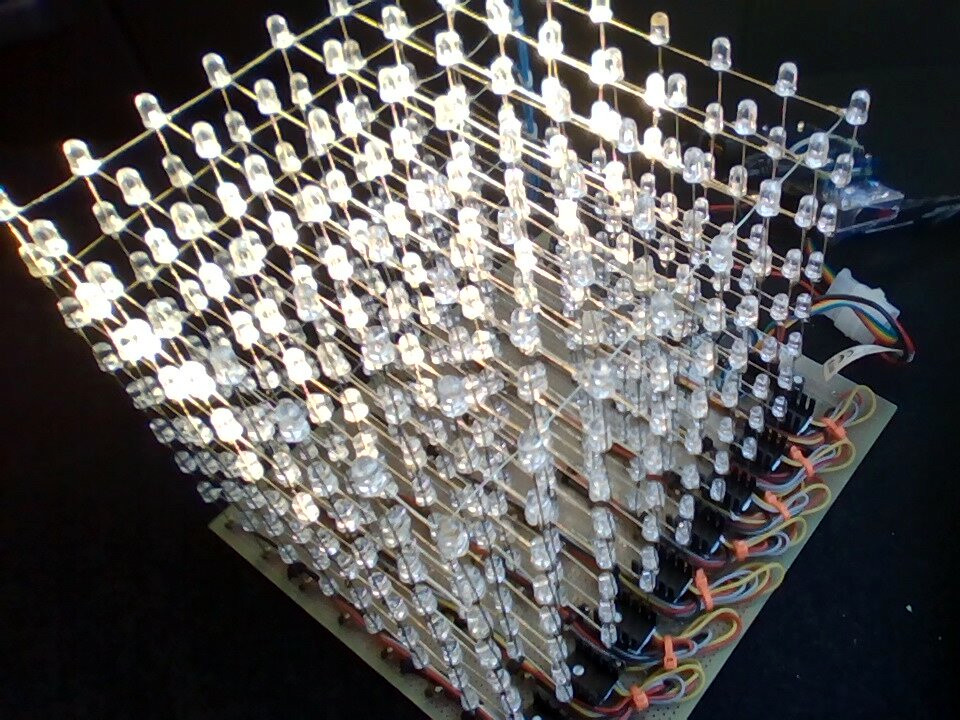

# p18-LEDcube
p18-LEDcube is a 8x8x8 three-dimensional LED matrix that builds atop [libledmtx](https://github.com/jalopezg-git/libledmtx).
Conceptually, it is a 2D matrix in which rows have been physically layouted as a Y plane (i.e., for libledmtx each slice appears as a 64-pixel scanline).

This project is work in progress.
